# Intuitive Academy Grading System

#### Team members (In order of last name):

*   **Chenyu Cao:** Participated in model designing. Implemented most part of the UI.

*   **Hanyu Chen:** Deployed MySQL and built table structures. Participated in model designing; designed user interface for adding and dropping students and statistical summaries for courses.

*   **Zhenghang Yin:** Data driver encapsulating of SQL table structures into Java objects. Participated in model designing. Designed the UI of managing courses feature.

## Introduction

The project is the final project for the class CS 611: Object-oriented Software Principles and Design using Java, aiming to make full advantage of software engineering design thinking, combining Java's object-oriented capabilities with the Swing UI framework to build a simple academic grading system for the instructors.

## How-to-run Instructions

#### Install MySQL and import database structure

1.  First, download MySQL and install it, performing the default installation configuration.

2.  Locate the database recovering script in the `utils/MYSQL_Import.sql`。

    *   First get connected to your MySQL Server:

        `$ mysql -u username -p password`

    *   Then create database and import it:

        ```sql
        mysql> CREATE DATABASE GradingSystem;
        mysql> use GradingSystem;
        mysql> source utils/MYSQL_Import.sql;
        
        ```

3.  Configure the username and password to connect to the server.

    Open file `src/edu/bu/super_intuitive/middleware/mysql/Database.java`, modify the following lines:

    ```java
    public class Database {
        private static final String DRIVER_NAME = "com.mysql.cj.jdbc.Driver";
        
        // Specify your MySQL server IP here
        private static final String DOMAIN = "localhost";
        private static final int PORT = 3306;
        
        // Specify your MySQL server username here
        private static final String USERNAME = "root";
        
        // Specify your MySQL server login password here
        private static final String PASSWORD = "root1234";
        
    ...
    ```

4.  Run `edu.bu.super_intuitive.UI.Main` with your building tool.

    You should see the following login frame:

    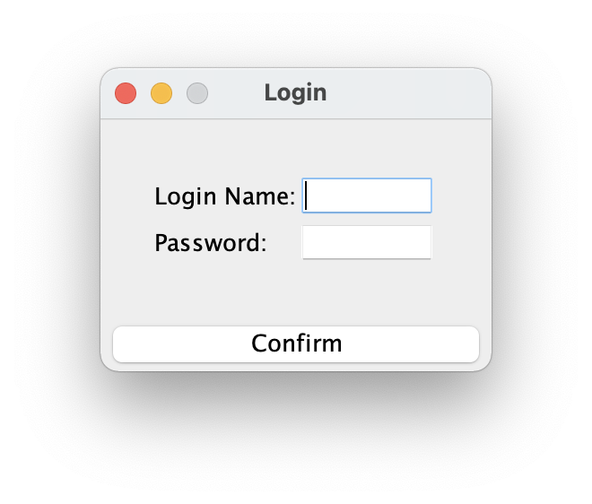

    The login window here is for decorative purposes only. The login name will always be `cpk`, and password should be any text length greater than 3.

## Model Design

The project has three kinds of entities: `Staff`, `Course` and `Assignment`.

*   **Staff** represents each faculty/student in the current campus database.

*   **Course** represents all the courses open in the school database.

    *   Each **course** must have an Instructor, which must be a `Staff` object with `isInstructor = 1`.

    *   **Student** objects (`Staff` objects with `isInstructor = 0`) and Courses can be bound as registration. This will be represented in the database as the `student_reg` table.

*   **Assignment** represents all registered assignments in the database.

    *   Each `assignment` must be part of a `course`, i.e., each assignment is offered by a course.

    *   Each student has a score for doing an `assignment`. This is reflected in the `student_score` table.

This model is reflected in the database as the following framework diagram:

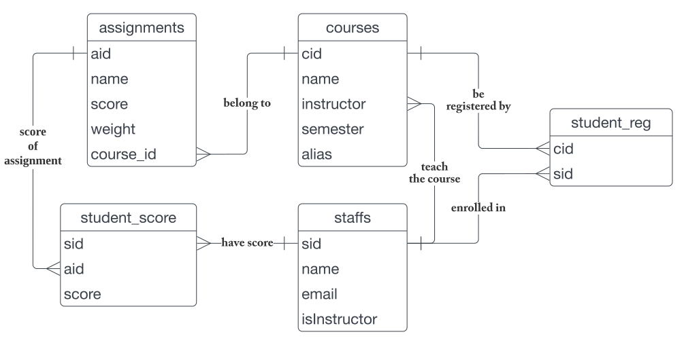

When the model is wrapped in Java format objects, I wrapped the low-level SQL queries to make it easier for the callers (back-end and front-end developers) to use. The wrapped version will be covered in [Model Encapsulation](#model-encapsulation).

## Code Design

### Project Framework

The project framework was divided into the following categories:

*   [UI](src/edu/bu/super_intuitive/UI), Mainly stores user interface related code

    This will be covered in [User Interface](#user-interface).

*   [factory](src/edu/bu/super_intuitive/factory), stores some factory functions

*   [middleware](src/edu/bu/super_intuitive/middleware), stores some functions that establish database links. These functions are not the core of Java object-oriented programming.

*   [models](src/edu/bu/super_intuitive/models), holds the interface definitions for all objects within the grading system. This will be covered in [Model Encapsulation](#model-encapsulation).

*   [service](src/edu/bu/super_intuitive/service), holds the specific SQL query methods and definitions for all the objects to communicate with MySQL.

***

The codes stored in the `service` folder (`Assignment`, `Course`, `Member`, `Instructor` and `Student`) actually implement the interfaces defined in models (`IAssignment`, `ICourse`, `IMember`, `IInstructor` and `IStudent`). The reason for distinguishing models from services is that models are mainly used in the functional design phase. When designing an object, we care about what member functions the object has, not about how they are implemented (what the SQL code is). As API users, they also only care about what functions the object has. Therefore it is more useful to separate the objects' definition (interfaces) and implementation (actual codes).

***

Within the object-oriented world, everything has a subject and an object attached (e.g., `Instructor.remove(course)`). But some functions do not have a subject, and these functions are defined by the world: for example, directly listing all student objects in the entire database. This operation is easy to do in SQL, just query the `staffs` table, but in Java the context is hard to categorize. So we put them under the `factory` folder to indicate that they are some special factory functions to get some special objects.

### Model Encapsulation

Why do we need to encapsulate objects? Mainly because in a relational database, it is difficult to truly represent the relationship between two entities. For example, if a teacher offers a course, here it is reflected in the two tables, one is `courses`, there is an `instructor` field that matches a certain `sid` in the other table `staffs`. When users use SQL to make queries, they need to process primary keys in multiple tables and then make queries, which is very inefficient and inconvenient to truly strip the front and back ends.

When the model is wrapped in Java format objects, I wrapped the low-level SQL queries to make it easier for the callers (back-end and front-end developers) to use. After encapsulation, the `getInstructor()` function of the Course object returns a real Java `Instructor` object, which can directly access further properties and member functions. This allows developers to focus directly on the Java language without caring about how the underlying SQL is implemented.

The wrapped version contains the following classes.

#### Assignment Interface

The `IAssignment` interface encapsulates some properties inherent to the `assignments` table in the database, such as: score, weight and name.

In addition, Assignment encapsulates the `student_score` table for the convenience of accessing students' scores, adding the `setStudentScore`, `getStudentScore` and `hasStudentScore` member functions.

Example: We have `IStudent studentMike`,  `IAssignment assignment1`. If Mike's score on `assignment1` is 80, just perform the following operations:

```java
assignment1.setStudentScore(studentMike, 80);
```

For more information, please see \[IAssignment.java]。

#### Course Interface

The `ICourse` interface encapsulates some properties inherent to the `courses` table in the database, such as: `Instructor`, `Alias`, `Name`, `Semester` and `Registered Students`.

The SQL statement will only return the `sid` of the instructor corresponding to the course, but here `getInstructor()` will be further encapsulated it to return the real `IInstructor` interface object that can be use easily. The same is true for Registered Students, where the SQL returns a series of student `sid`s and wraps them all into `IStudent` objects.

#### Member Interface

The `IMember` interface encapsulates most basic properties in staffs table (`BUId`, `Name` and `Email`). In practice, however, we want to distinguish between Instructor and Student, so the Member interface is designed to be abstract. In fact, the user should create `IInstructor` and `IStudent` interface objects, as mentioned below.

#### Instructor Interface

The `IInstructor` interface encapsulates objects in `staffs` table with `isInstructor` = 1. In addition to the base properties provided by IMember, the following features are added:

```java
// List all courses open by the instructor
ICourse[] getOwnedCourses();

// Open a new course taught by the instructor
ICourse openCourse(String courseName,
                   String courseAlias,
                   String semester) throws InstantiationException;
                   
// Remove a course by the instructor
void removeCourse(ICourse course) throws OperationFailed;

boolean hasOwnedCourse(ICourse course);
```

For example, if instructor `saenko` want to open a new course, number **"CS 723"**, course name **"Advanced Deep Learning"**, just perform the following operations:

```java
var newCourse = saenko.openCourse(
  "Advanced Deep Learning", "CS 723", "Fall 2021");
```

The `IInstructor` interface also provides other functions like `registerStudent`, `addAssignment`, etc. For more information, please see \[ICourse.java]。

#### Student Interface

The `IStudent` interface encapsulates objects in `staffs` table with `isInstructor` not equal to 1.

The student is a passive object within the grading system, i.e. he/she has no way to enroll himself into the course, he/she must be added to a course by an instructor, and assigns him/her the work. So the student has only the read-only properties. The following additional features are added:

```java
/**
 * @return Return all courses that the student Attended
 */
ICourse[] getAttendingCourses();
/**
 * Returns the student's score for a particular test
 * @param assignment assignment object
 * @return score
 */
double getAssignmentScore(IAssignment assignment);
/**
 * Set the student's score for a particular exam
 * @param assignment assignment object
 * @param score score object
 */
void setAssignmentScore(IAssignment assignment, double score);
```

### User Interface

This chapter introduces the main dialogs in the program. The windows were designed by three people and implemented mainly by Chenyu Cao and Hanyu Chen.

1.  Login Window. We originally designed each Staff to have its own dedicated login and password. However, this feature was eventually cut due to work hours. Now the login name will always be `cpk`, and password should be any text length greater than 3.

2.  After logging in, the first screen displayed is the **Manage Courses screen for instructors**. Designed by Chenyu Cao.

    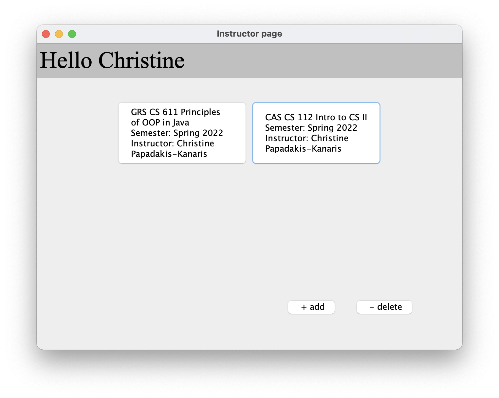

    Instructors can click `+` / `-` to add or remove courses.

    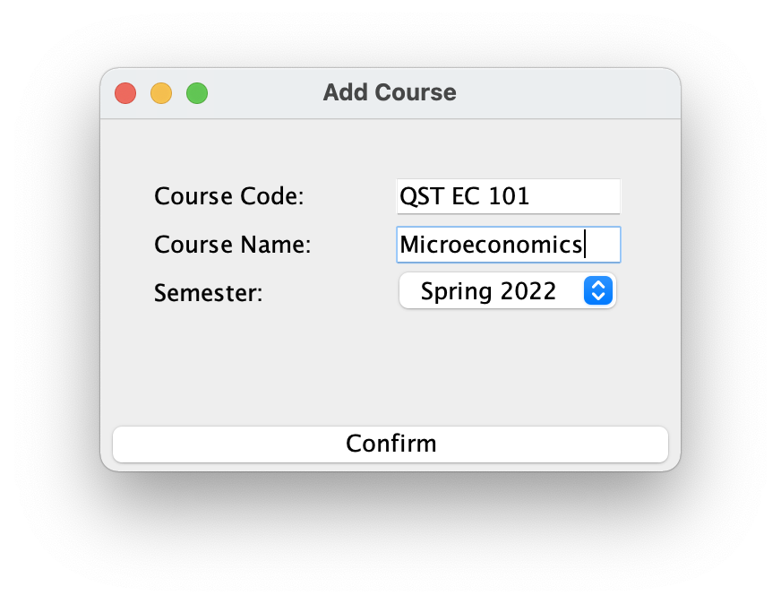

    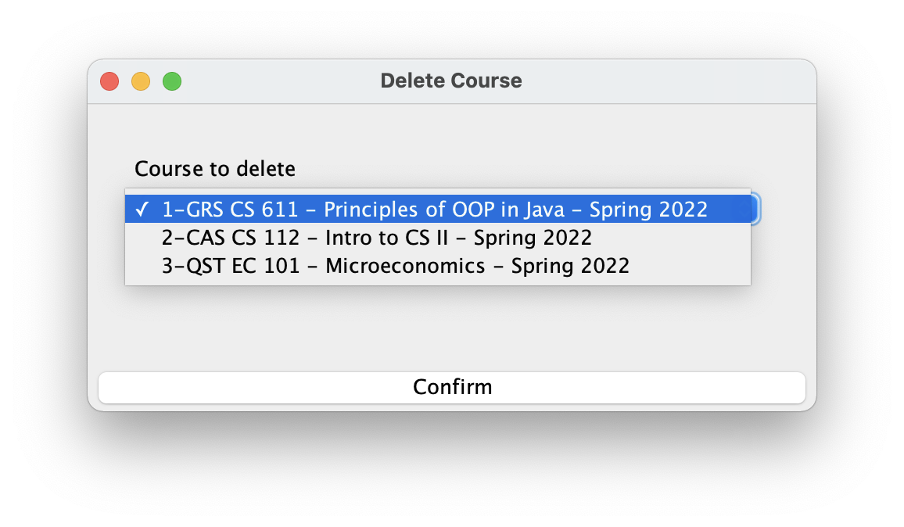

3.  After clicking on any course, you will see the course management interface. Users can **set up assignments**, **set up students**, **calculate summaries**, **import** and **export data**. Designed by Zhenghang Yin.

    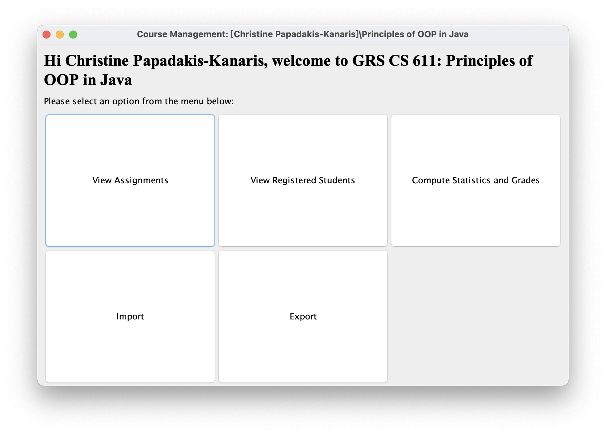

4.  **Setting up Assignment** window, this is a Tabbed window that can be switched to the **Student Enrollment window**. Designed by Zhenghang Yin.

    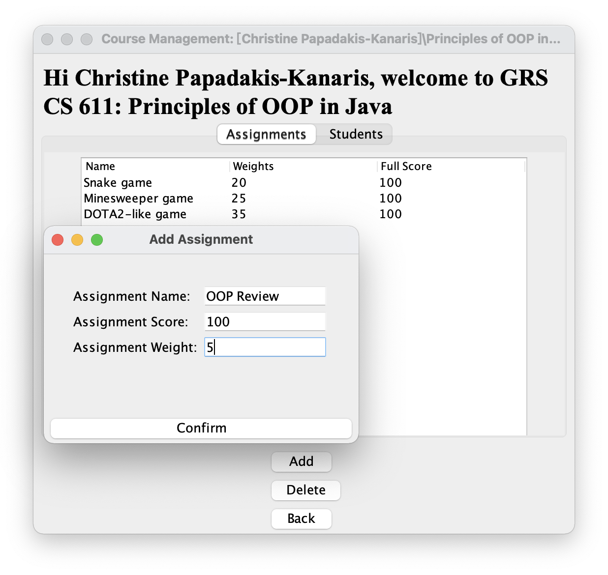

5.  Student Enrollment window, this is a Tabbed window that can be switched to the **Setting up Assignment**. Designed by Zhenghang Yin.

    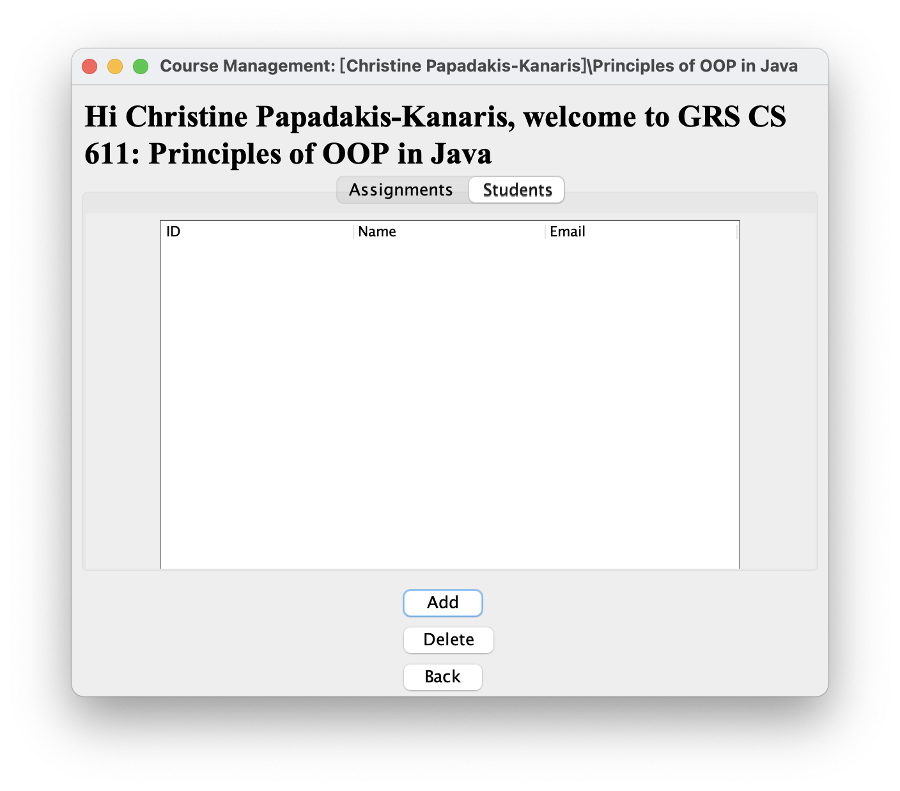

6.  Student search and add screen, by Hanyu Chen.

    This window brings together three functions: fuzzy search for student names, adding to pending list, and refreshing the list contents at any time.

    *   Fuzzy search for student names

        Enter the student name, click Search, and the window will display the searched students (`isInstructor ≠ 1`). If no content is entered, all students will be listed.

        > The names listed here are not all real names and are for educational purposes only.

        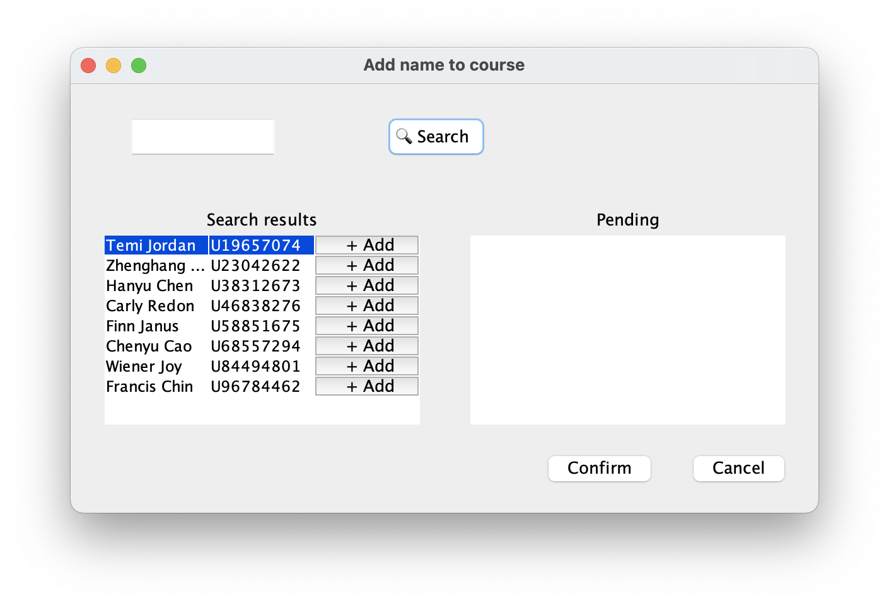

    *   Adding to Pending list

        Clicking the `+Add` button to the right of each user will add the student to the Pending list on the right. Be sure to press `Confirm` to actually add the student to the course.

        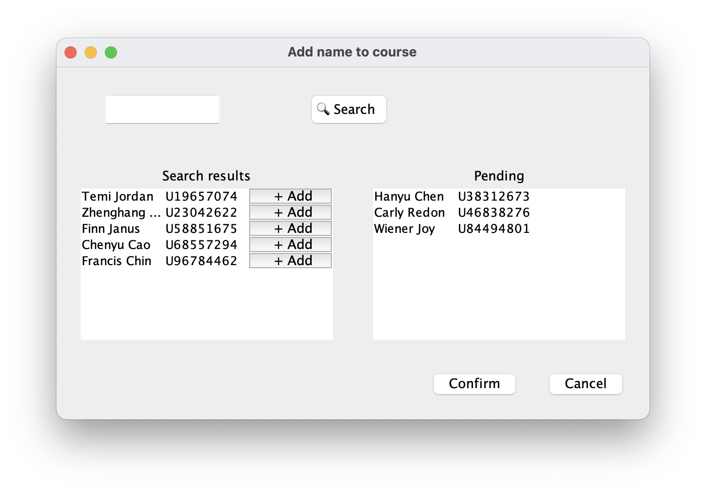

    *   Refresh list content at any time

        Swing UI cannot dynamically update the list by default by changing the data source when creating the list. Here Hanyu Chen designs an algorithm that allows the event listener to dynamically refresh the contents of the list based on the original data modification.

    When you press `Confirm`, the student is added to the course. Press `Cancel` to cancel the window without changes.

    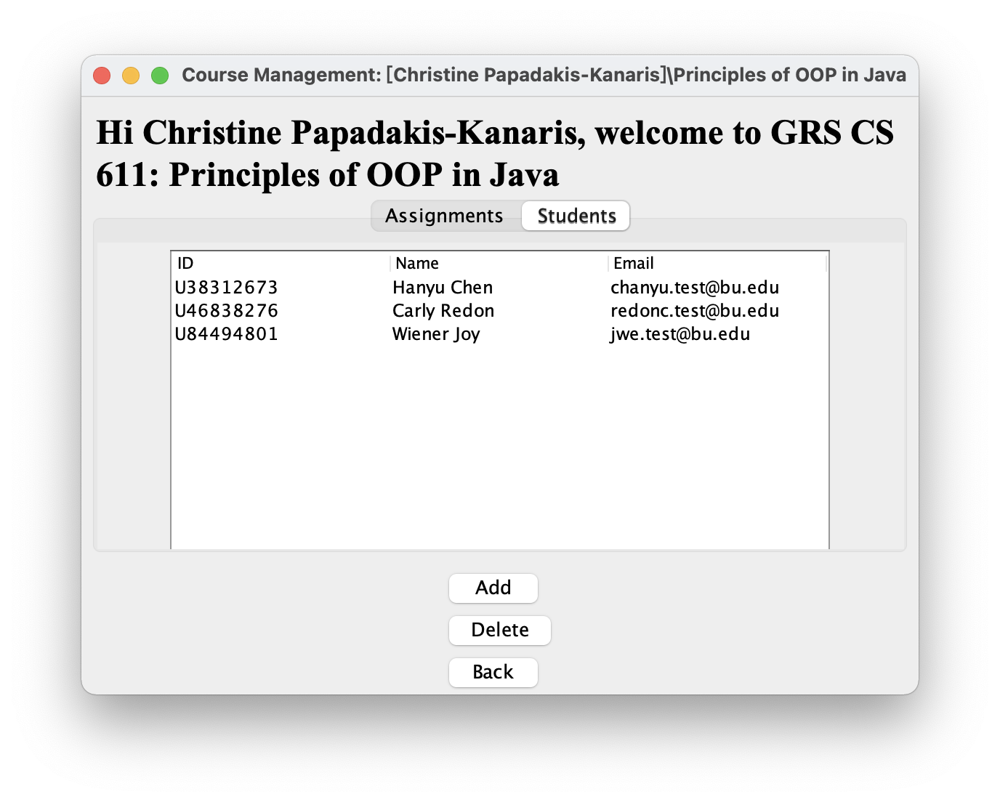

7.  Course statistics window, showing course summary information, by Chenyu Cao.

    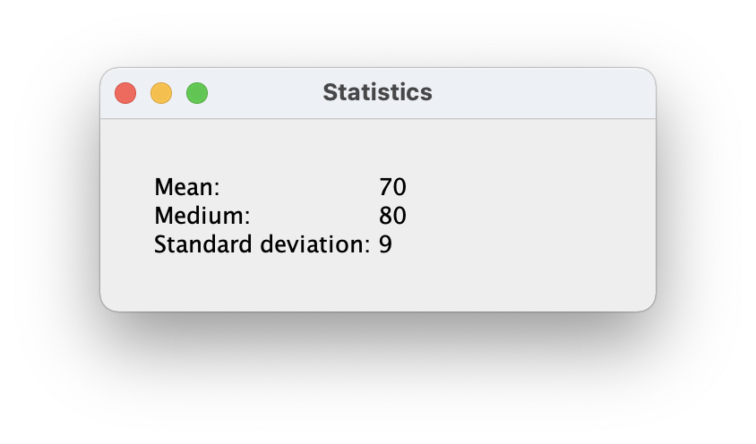

8.  Import CSV data into database tables, by Chenyu Cao.

    Test cases can be found in [assignmentTest.csv](assignmentTest.csv) and [courseTest.csv](courseTest.csv).

    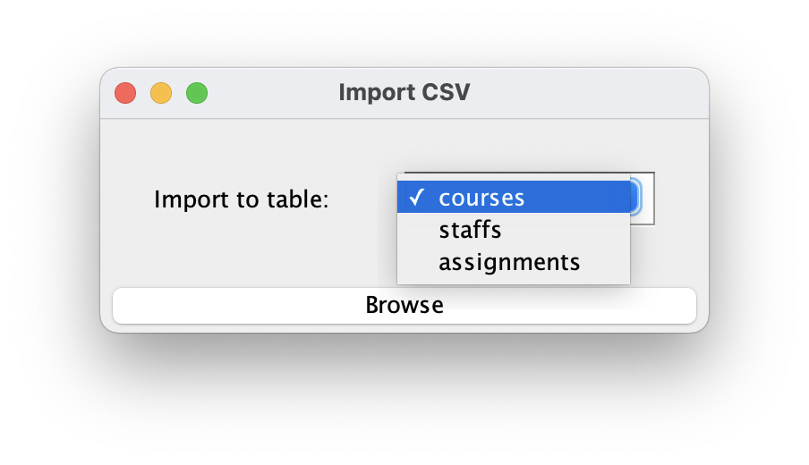

9.  Export CSV data to file, by Chenyu Cao.

    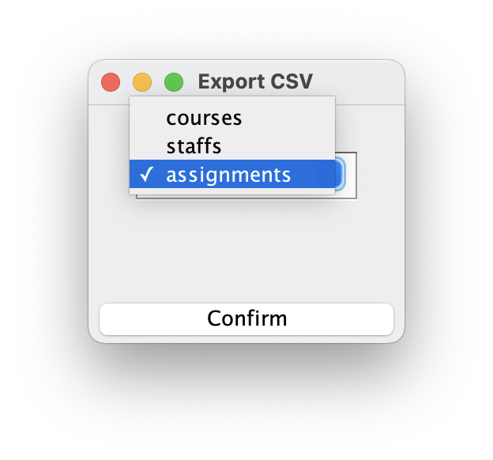

## Thoughts and future work

In this project, we wrote this a simple teaching and learning grading system by learning software development thinking and combining it with Java object-oriented programming practice. We have achieved the following in the project.

*   After the experience of using Swing UI, we learned what user interface programming is and laid the foundation for developing apps later.

*   We learned the importance of frameworks in the development process through well-designed frameworks.

*   Consolidated and reviewed the knowledge of SQL.

*   Encapsulated the underlying objects to achieve a true front and back-end stripping.

However, due to time, we also have a series of unfinished work. In the future the following features may be completed:

*   Dedicated dialog for adding new users/students function.

*   A dialog box to set the student's grade for each assignment.

*   More detailed statistical functions.

*   Chart analysis function
